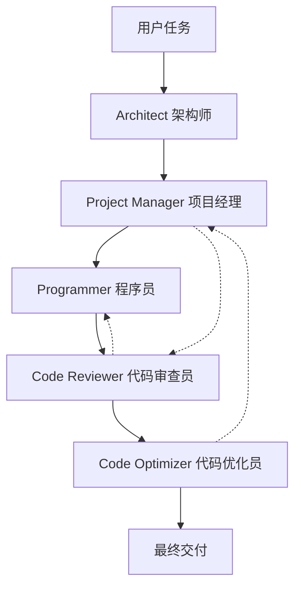

# AutoGen Programming Workflow (Iris API Server)

一个基于Microsoft AutoGen框架的多Agent编程工作流系统，实现了5个专业化Agent的协作开发流程。

## 🎯 项目概述

本项目实现了一个完整的多Agent编程工作流，包含以下5个专业化Agent：

1. **🏗️ Architect (架构师)** - 负责系统架构设计与技术决策
2. **📋 Project Manager (项目经理)** - 负责项目协调与开发管理
3. **💻 Programmer (程序员)** - 负责代码编写与实现
4. **🔍 Code Reviewer (代码审查员)** - 负责代码质量审查与建议
5. **⚡ Code Optimizer (代码优化员)** - 负责代码优化与性能提升

## ✨ 主要特性

- **🤖 多Agent协作**: 5个专业化Agent协同工作
- **🔄 完整工作流**: 从架构设计到代码优化的完整开发流程
- **🎛️ 灵活配置**: 支持Google Gemini和OpenAI模型
- **📊 实时监控**: 工作流状态跟踪和进度监控
- **💾 结果保存**: 自动保存所有工作产物和文档
- **🛡️ 质量保证**: 内置代码审查和优化机制
- **🐳 Docker容器化**: 完整的容器化解决方案
- **🔄 CI/CD集成**: GitHub Actions自动化流程

## 🚀 快速开始

### 环境要求

- Python 3.9+
- Google Gemini API Key 或 OpenAI API Key

### 安装依赖

```bash
# 克隆项目
git clone <repository-url>
cd DataApiServer

# 安装依赖
pip install -r requirements.txt
```

### 配置API密钥

#### 方法1: 环境变量
```bash
# 使用Google Gemini (推荐)
export GOOGLE_API_KEY="your_gemini_api_key"

# 或使用OpenAI
export OPENAI_API_KEY="your_openai_api_key"
```

#### 方法2: 配置文件
```bash
# 创建配置文件模板
python autogen_workflow/main.py --create-config

# 编辑 workflow_config.json 文件
```

### 验证安装

```bash
# 测试安装是否正确
python tests/autogen/test_installation.py
```

### 运行示例

```bash
# 快速演示 (推荐新手)
python tests/autogen/demo.py

# 运行完整示例工作流
python autogen_workflow/main.py --mode example

# 交互式模式
python autogen_workflow/main.py --mode interactive

# 使用配置文件
python autogen_workflow/main.py --mode config --config workflow_config.json
```

## 🏗️ 系统架构

### Agent设计



### 工作流程

1. **架构设计阶段**
   - 分析需求和约束
   - 设计系统架构
   - 选择技术栈
   - 定义组件接口

2. **项目规划阶段**
   - 创建实施计划
   - 分解任务和里程碑
   - 分配资源和时间线
   - 定义质量标准

3. **代码实现阶段**
   - 编写清洁、可维护的代码
   - 实现业务逻辑
   - 添加错误处理
   - 编写单元测试

4. **代码审查阶段**
   - 检查代码质量
   - 识别安全漏洞
   - 验证最佳实践
   - 提供改进建议

5. **代码优化阶段**
   - 性能优化
   - 代码重构
   - 应用设计模式
   - 提升可维护性

## 📁 项目结构

```
DataApiServer(0612)/
├── README.md                   # 项目主文档
├── requirements.txt            # 依赖配置
├── .env                        # 环境变量配置
├── autogen_workflow/           # 核心业务代码
│   ├── __init__.py            # 包初始化
│   ├── config.py              # 配置管理
│   ├── workflow.py            # 主工作流逻辑
│   ├── main.py                # 程序入口点
│   ├── gemini_client.py       # Gemini API客户端
│   ├── mock_gemini_client.py  # Mock客户端(测试用)
│   └── agents/                # Agent实现
│       ├── __init__.py
│       ├── architect.py       # 架构师Agent
│       ├── project_manager.py # 项目经理Agent
│       ├── programmer.py      # 程序员Agent
│       ├── code_reviewer.py   # 代码审查员Agent
│       └── code_optimizer.py  # 代码优化员Agent
├── tests/                     # 测试脚本归档
│   ├── README.md              # 测试说明
│   ├── autogen/               # AutoGen测试
│   │   ├── test_installation.py
│   │   ├── test_imports.py
│   │   └── demo.py
│   ├── gemini/                # Gemini API测试
│   │   ├── api/               # API连接测试
│   │   ├── models/            # 模型测试
│   │   └── clients/           # 客户端测试
│   ├── scripts/               # Shell脚本
│   │   └── curl/              # curl测试脚本
│   ├── logs/                  # 测试日志
│   └── reports/               # 测试报告
└── docs/                      # 文档 (建议)
    ├── QUICK_START.md
    ├── Workflow_README.md
    └── ARCHITECTURE_CLEANUP.md
```

## 🔧 配置选项

### 模型配置

```json
{
  "gemini_api_key": "your_gemini_api_key",
  "gemini_model": "gemini-2.0-flash",
  "openai_api_key": "your_openai_api_key", 
  "openai_model": "gpt-4o-mini",
  "temperature": 0.7,
  "max_tokens": 4000
}
```

### 工作流配置

```json
{
  "max_rounds": 20,
  "max_messages": 50,
  "timeout_seconds": 300
}
```

## 📊 使用示例

### 基本用法

```python
from autogen_workflow import ProgrammingWorkflow, WorkflowConfig

# 创建工作流
config = WorkflowConfig.create_default()
workflow = ProgrammingWorkflow(config)

# 定义任务
task = """
创建一个FastAPI数据分析API服务器，包含：
- 文件上传功能
- 数据处理和分析
- 可视化图表生成
- JWT认证
- 异步处理
"""

# 运行工作流
result = await workflow.run_workflow(task)

# 检查结果
if result["status"] == "success":
    print("工作流完成!")
    artifacts = result["artifacts"]
    # 处理生成的代码和文档
```

### 高级用法

```python
# 自定义配置
from autogen_workflow.config import ModelConfig, WorkflowConfig

model_config = ModelConfig(
    gemini_api_key="your_key",
    gemini_model="gemini-2.0-flash",
    temperature=0.8,
    max_tokens=6000
)

workflow_config = WorkflowConfig(
    model_config=model_config,
    max_rounds=30,
    max_messages=100
)

workflow = ProgrammingWorkflow(workflow_config)

# 带上下文的任务
context = {
    "project_type": "data_api",
    "target_environment": "production",
    "team_size": "5 developers"
}

result = await workflow.run_workflow(task, context)
```

## 🧪 测试

项目包含完整的测试套件，所有测试脚本已归档到 `tests/` 目录：

### AutoGen测试
```bash
# 验证AutoGen安装
python tests/autogen/test_installation.py

# 测试模块导入
python tests/autogen/test_imports.py

# 运行工作流演示
python tests/autogen/demo.py
```

### Gemini API测试
```bash
# 测试API连接
python tests/gemini/api/simple_gemini_test.py

# 测试模型可用性
python tests/gemini/models/test_gemini_models.py

# 测试客户端功能
python tests/gemini/clients/test_gemini_client.py
```

### Shell脚本测试
```bash
# 使用curl测试API
cd tests/scripts/curl
./test_curl.sh

# 测试预览模型
./test_preview_models.sh
```

详细测试说明请参考 [`tests/README.md`](tests/README.md)

## 📈 输出结果

工作流完成后会生成以下产物：

- **架构设计文档** (`architecture_design.md`)
- **实施计划** (`implementation_plan.md`)
- **源代码文件** (`source_code/`)
- **代码审查报告** (`reviews/`)
- **优化建议** (`optimizations/`)
- **完整工作流结果** (`workflow_result.json`)

## 🛠️ 开发指南

### 添加新Agent

1. 在 `agents/` 目录创建新的Agent类
2. 继承适当的基类并实现必要方法
3. 在 `config.py` 中添加Agent配置
4. 在 `workflow.py` 中集成新Agent

### 自定义工作流

1. 修改 `workflow.py` 中的工作流逻辑
2. 调整Agent间的交互模式
3. 添加新的终止条件
4. 实现自定义的结果处理

## 🔍 故障排除

### 常见问题

1. **API密钥错误**
   ```
   ValueError: No valid API key found for Gemini or OpenAI
   ```
   解决：检查环境变量或配置文件中的API密钥

2. **模型不可用**
   ```
   Model 'gemini-2.5-pro' not available
   ```
   解决：使用可用的模型如 `gemini-2.0-flash`

3. **内存不足**
   ```
   OutOfMemoryError during workflow execution
   ```
   解决：减少 `max_tokens` 或 `max_messages` 配置

### 调试模式

```bash
# 启用详细日志
python autogen_workflow/main.py --log-level DEBUG

# 检查配置
python autogen_workflow/main.py --mode config --config your_config.json
```

## 🤝 贡献指南

1. Fork 项目
2. 创建特性分支 (`git checkout -b feature/AmazingFeature`)
3. 提交更改 (`git commit -m 'Add some AmazingFeature'`)
4. 推送到分支 (`git push origin feature/AmazingFeature`)
5. 开启 Pull Request

## 📄 许可证

本项目采用 MIT 许可证 - 查看 [LICENSE](LICENSE) 文件了解详情。

## 🙏 致谢

- [Microsoft AutoGen](https://github.com/microsoft/autogen) - 多Agent框架
- [Google Gemini](https://ai.google.dev/) - AI模型支持
- [OpenAI](https://openai.com/) - AI模型支持

## 📞 联系方式

- 项目维护者: DataLab Team
- 邮箱: contact@datalab.com
- 项目链接: [GitHub Repository](https://github.com/datalablife/data-api-server)

---

**注意**: 本项目基于用户记忆中的偏好配置，优先使用Google Gemini API和gemini-2.0-flash模型。
