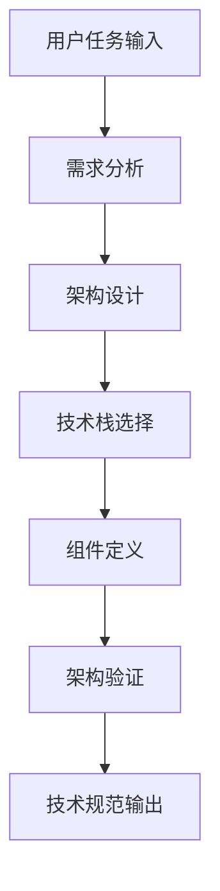
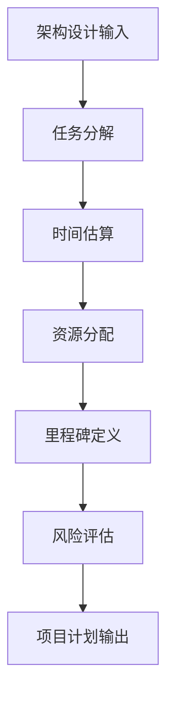
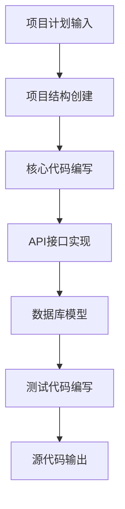
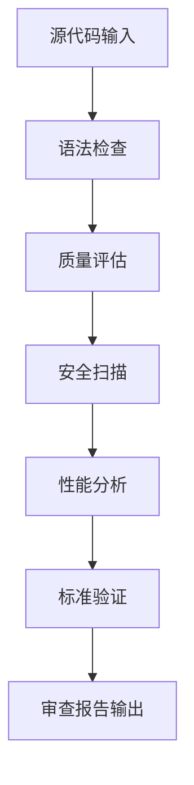
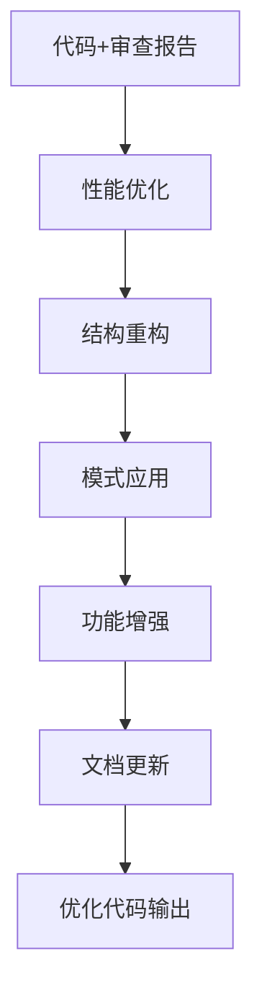

# AutoGen 多Agent编程工作流详细说明

## 🎯 工作流概述

本工作流基于Microsoft AutoGen框架实现，包含5个专业化Agent的协作开发流程，从架构设计到代码优化的完整软件开发生命周期。

## 🤖 Agent详细说明

### 1. Architect (架构师) Agent

**职责**：
- 系统架构设计与管理
- 技术栈选择和评估
- 组件接口定义
- 技术风险评估

**核心功能**：
- `analyze_requirements()` - 需求分析
- `design_architecture()` - 架构设计
- `validate_architecture()` - 架构验证
- `create_technical_specifications()` - 技术规范创建

**输出产物**：
- 系统架构文档
- 技术规范说明
- 组件设计图
- 实施路线图

### 2. Project Manager (项目经理) Agent

**职责**：
- 项目规划与协调
- 任务分解与分配
- 进度跟踪与管理
- 质量控制与风险管理

**核心功能**：
- `create_project_plan()` - 项目计划创建
- `track_progress()` - 进度跟踪
- `generate_status_report()` - 状态报告生成
- `manage_workflow()` - 工作流管理

**输出产物**：
- 项目实施计划
- 任务分解结构
- 里程碑定义
- 风险管理计划

### 3. Programmer (程序员) Agent

**职责**：
- 代码编写与实现
- 单元测试编写
- 技术文档编写
- 代码规范遵循

**核心功能**：
- `generate_project_structure()` - 项目结构生成
- `create_fastapi_application()` - FastAPI应用创建
- `create_database_models()` - 数据库模型创建
- `create_api_routes()` - API路由创建

**输出产物**：
- 完整源代码
- 单元测试代码
- 配置文件
- 部署脚本

### 4. Code Reviewer (代码审查员) Agent

**职责**：
- 代码质量审查
- 安全漏洞检测
- 性能问题识别
- 编码标准验证

**核心功能**：
- `review_code()` - 代码审查
- `check_security_issues()` - 安全检查
- `check_performance_issues()` - 性能检查
- `generate_review_report()` - 审查报告生成

**审查标准**：
- 代码质量 (可读性、可维护性)
- 安全性 (漏洞扫描、输入验证)
- 性能 (算法效率、资源使用)
- 标准合规 (PEP8、类型提示)

### 5. Code Optimizer (代码优化员) Agent

**职责**：
- 性能优化与改进
- 代码重构与优化
- 设计模式应用
- 可扩展性增强

**核心功能**：
- `optimize_code()` - 代码优化
- `apply_performance_optimizations()` - 性能优化
- `implement_design_patterns()` - 设计模式实现
- `add_advanced_features()` - 高级功能添加

**优化策略**：
- 算法优化 (时间复杂度改进)
- 内存优化 (内存使用优化)
- 数据库优化 (查询优化、连接池)
- 缓存实现 (Redis缓存策略)

## 🔄 工作流执行流程

### 阶段1: 架构设计 (Architecture Design)



**关键活动**：
1. 分析功能和非功能需求
2. 设计系统整体架构
3. 选择合适的技术栈
4. 定义组件接口和交互
5. 验证架构可行性
6. 输出技术规范文档

### 阶段2: 项目规划 (Project Planning)



**关键活动**：
1. 将架构转化为具体任务
2. 估算开发时间和资源
3. 定义项目里程碑
4. 识别和评估风险
5. 制定质量标准
6. 输出详细项目计划

### 阶段3: 代码实现 (Code Implementation)



**关键活动**：
1. 创建项目目录结构
2. 实现核心业务逻辑
3. 开发API接口
4. 设计数据库模型
5. 编写单元测试
6. 添加配置和部署文件

### 阶段4: 代码审查 (Code Review)



**关键活动**：
1. 检查代码语法和结构
2. 评估代码质量指标
3. 扫描安全漏洞
4. 分析性能瓶颈
5. 验证编码标准
6. 生成详细审查报告

### 阶段5: 代码优化 (Code Optimization)



**关键活动**：
1. 实施性能优化策略
2. 重构代码结构
3. 应用设计模式
4. 添加高级功能
5. 更新技术文档
6. 输出最终优化代码

## 🛠️ 配置和自定义

### Agent配置自定义

每个Agent都可以通过配置文件进行自定义：

```python
# 自定义Architect Agent
architect_config = AgentConfig(
    name="architect",
    description="高级系统架构师",
    system_message="你是一个经验丰富的系统架构师...",
    handoffs=["project_manager", "user"],
    tools=["architecture_analyzer", "tech_stack_evaluator"]
)
```

### 工作流程自定义

可以通过修改`workflow.py`来自定义工作流程：

```python
# 自定义终止条件
custom_termination = (
    HandoffTermination(target="user") | 
    TextMentionTermination("COMPLETE") |
    MaxMessageTermination(max_messages=30)
)

# 自定义Agent交互模式
custom_team = Swarm(
    participants=agents,
    termination_condition=custom_termination,
    max_turns=15
)
```

## 📊 输出产物说明

### 1. 架构设计文档 (architecture_design.md)

包含：
- 系统概述和目标
- 架构图和组件说明
- 技术栈选择理由
- 接口定义和数据流
- 部署架构说明

### 2. 项目实施计划 (implementation_plan.md)

包含：
- 项目阶段和里程碑
- 任务分解和时间估算
- 资源需求和分配
- 风险识别和缓解策略
- 质量标准和验收条件

### 3. 源代码文件 (source_code/)

包含：
- 主应用程序代码
- API路由和控制器
- 数据模型和服务
- 配置文件和环境设置
- 部署脚本和容器配置

### 4. 代码审查报告 (reviews/)

包含：
- 代码质量评分
- 安全漏洞报告
- 性能问题分析
- 改进建议清单
- 标准合规检查结果

### 5. 优化报告 (optimizations/)

包含：
- 性能优化实施
- 代码重构说明
- 设计模式应用
- 新功能添加
- 基准测试结果

## 🔧 高级使用技巧

### 1. 任务上下文优化

提供详细的上下文信息可以显著提高工作流质量：

```python
context = {
    "project_type": "data_api",
    "target_environment": "production",
    "expected_load": "10000+ requests/hour",
    "team_experience": "senior",
    "timeline": "8 weeks",
    "budget_constraints": "medium",
    "compliance_requirements": ["GDPR", "SOC2"],
    "existing_infrastructure": "AWS",
    "preferred_technologies": ["Python", "FastAPI", "PostgreSQL"]
}
```

### 2. 分阶段执行

对于大型项目，可以分阶段执行工作流：

```python
# 阶段1: 仅架构设计
result_phase1 = await workflow.run_workflow(
    task="设计数据分析API架构",
    context={"phase": "architecture_only"}
)

# 阶段2: 基于架构进行实现
result_phase2 = await workflow.run_workflow(
    task="基于已有架构实现核心功能",
    context={"architecture": result_phase1["artifacts"]["architecture_design"]}
)
```

### 3. 质量控制

设置严格的质量门禁：

```python
quality_config = {
    "min_code_coverage": 85,
    "max_complexity": 8,
    "security_scan_required": True,
    "performance_benchmark_required": True,
    "documentation_required": True
}
```

## 🚀 最佳实践

### 1. 任务描述最佳实践

- **具体明确**: 提供具体的功能需求和技术要求
- **上下文丰富**: 包含项目背景、约束条件、目标用户
- **优先级清晰**: 明确核心功能和可选功能
- **标准明确**: 指定质量标准和验收条件

### 2. 配置优化建议

- **模型选择**: 根据任务复杂度选择合适的模型
- **参数调优**: 调整temperature和max_tokens以平衡创造性和准确性
- **超时设置**: 根据任务复杂度设置合理的超时时间
- **消息限制**: 设置合理的消息数量限制避免无限循环

### 3. 结果处理建议

- **增量保存**: 定期保存中间结果避免丢失
- **版本控制**: 对生成的代码进行版本管理
- **质量验证**: 对生成的代码进行额外的质量检查
- **人工审核**: 重要项目建议进行人工最终审核

## 🔍 故障排除

### 常见问题和解决方案

1. **Agent无响应**
   - 检查API密钥是否有效
   - 增加超时时间设置
   - 检查网络连接状态

2. **代码质量不佳**
   - 提供更详细的需求描述
   - 调整模型参数设置
   - 增加质量检查步骤

3. **工作流中断**
   - 检查终止条件设置
   - 查看错误日志信息
   - 验证Agent配置正确性

4. **性能问题**
   - 减少max_tokens设置
   - 优化任务描述长度
   - 使用更快的模型

## 📈 扩展开发

### 添加新Agent

1. 创建Agent类继承基础Agent
2. 实现必要的方法和功能
3. 在配置中添加Agent定义
4. 更新工作流逻辑集成新Agent

### 自定义工作流模式

1. 定义新的工作流模式
2. 实现Agent间交互逻辑
3. 添加相应的终止条件
4. 测试和验证工作流程

### 集成外部工具

1. 定义工具接口和功能
2. 实现工具调用逻辑
3. 将工具分配给相应Agent
4. 测试工具集成效果

---

**注意**: 本工作流基于AutoGen最新版本开发，支持Google Gemini和OpenAI模型，优先使用用户偏好的gemini-2.0-flash模型。
